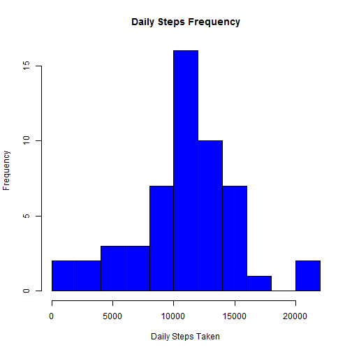
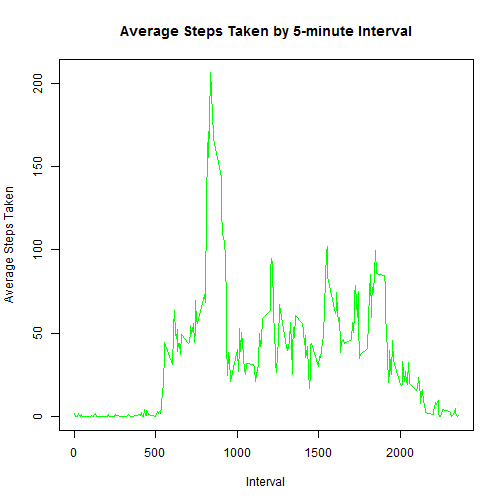
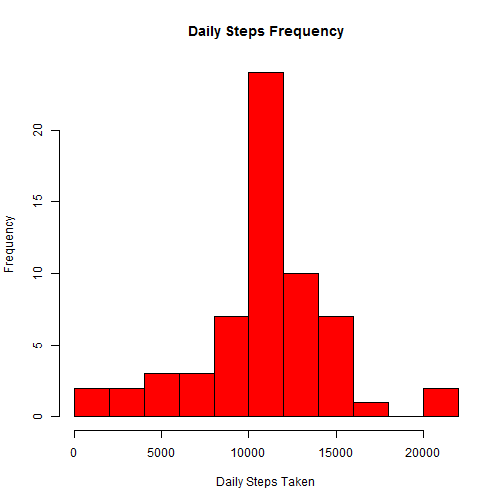
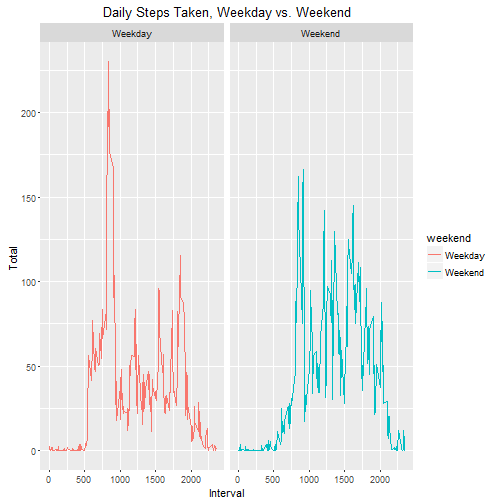

Reproducible Research Course Project 1
======================================
Activity monitoring analysis of an individual over a two month period using fitness tracking device

Data includes the number of steps taken by the individual at 5 minute intervals

First, the file is unzipped and the dataset is read in.  The date column is converted from a factor variable to a date.  We also load in the ggplot2 package
     

```r
        library(ggplot2)
        unzip("activity.zip")
        rawdata <- read.csv("activity.csv", header = TRUE)
        rawdata$date <- strptime(rawdata$date, "%Y-%m-%d")
        rawdata$date <- as.Date(rawdata$date)
```

Next, we calculate the daily total steps taken and present a summary of the data showing mean and median steps taken


```r
        daily_sums <- aggregate(steps ~ date, rawdata, sum, na.rm=TRUE)
        summary(daily_sums$steps)
```

```
##    Min. 1st Qu.  Median    Mean 3rd Qu.    Max. 
##      41    8841   10760   10770   13290   21190
```

Below is a histogram of the daily steps taken showing the frequency distribution


```r
        hist(daily_sums$steps, breaks = 8,
                main = "Daily Steps Frequency",
                col = "blue",
                xlab = "Daily Steps Taken",
                ylab = "Frequency"
     )
```



To examine the average daily activity patterns, the below aggregates the data across 5 minute intervals using the mean and presents the data in a time series plot


```r
        interval_means <- aggregate(steps ~ interval, rawdata, mean, na.rm = TRUE)
        plot(interval_means$interval, interval_means$steps,
             type = "l",
             main = "Average Steps Taken by 5-minute Interval",
             xlab = "Interval",
             ylab = "Average Steps Taken",
             col = "green"
             )
```



```r
        interval_means[which.max(interval_means$steps),]
```

```
##     interval    steps
## 104      835 206.1698
```

To deal with missing values, the below code creates a dataframe of incomplete values and prints the number of missing values


```r
  NA_values <- rawdata[(is.na(rawdata)),]
  nrow(NA_values)
```

```
## [1] 2304
```

Then we make a table of the average steps taken by interval for all complete observations, and merge this table with the incomplete observations, creating a new column for steps that replaces the NA values with that interval's average


```r
average_interval <- aggregate(steps ~ interval, rawdata, mean, na.rm=TRUE)
colnames(average_interval) = c("interval", "steps.computed")
replaced_NA <- merge(NA_values, average_interval, by="interval", all.x = TRUE)
```

Below, a dataset of just complete values is created, along with a new column replicating the steps column, which will contain all modified data once we merge the datasets


```r
nomissing <- rawdata[complete.cases(rawdata),]
nomissing$steps.computed <- nomissing$steps
activity_data <- rbind(replaced_NA, nomissing)
activity_data$steps.computed <- round(activity_data$steps.computed, digits = 0)
```

With the modified dataset with no missing values, we recreate the above histogram


```r
daily_sums2 <- aggregate(steps.computed ~ date, activity_data, sum)
hist(daily_sums2$steps.computed, breaks = 8,
                main = "Daily Steps Frequency",
                col = "red",
                xlab = "Daily Steps Taken",
                ylab = "Frequency"
 )
```



```r
        summary(daily_sums2$steps.computed)
```

```
##    Min. 1st Qu.  Median    Mean 3rd Qu.    Max. 
##      41    9819   10760   10770   12810   21190
```

We can see that replacing missing values with the means from that interval has no visible effect on the distribution of daily steps, the mean or the median steps taken

To determine whether patterns differ on weekends versus weekdays, we add a column to the dataset showing the day of the week, create a logical vector for weekdays and weekends, and plot the results with a panel each for weekdays and weekends


```r
activity_data$weekday <- weekdays(activity_data$date)
weekend <- c("Saturday","Sunday")
activity_data$weekend <- as.factor(ifelse(is.element(activity_data$weekday,weekend),"Weekend", "Weekday"))
interval_activity_means <- aggregate(steps.computed ~ interval + weekend, activity_data, mean)
ggplot(interval_activity_means, aes(interval, steps.computed,
                                 group=weekend, colour=weekend))+
        geom_line() +
        ggtitle("Daily Steps Taken, Weekday vs. Weekend") +
        xlab("Interval") +
        ylab("Total ") + facet_grid(.~weekend)
```



